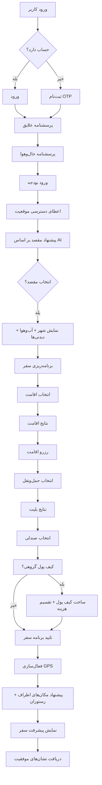

# جریان تجربه کاربری SafarYar

## نقاط کلیدی تجربه
- **آن‌بردینگ سریع:** حداکثر ۳ دقیقه تا مشاهده پیشنهاد مقصد.
- **در لحظه:** نمایش آب‌وهوا و وضعیت شلوغی مقصد از منابع زنده.
- **شخصی‌سازی:** توصیه‌ها متناسب با پرسونای تشخیص داده شده.
- **همگام‌سازی گروهی:** نمایش به‌روزرسانی کیف پول و تقسیم هزینه در لحظه.

## سنجه‌های تجربه کاربری (UX Metrics)
| گام | KPI هدف |
| --- | --- |
| تکمیل پرسشنامه | > ۸۵٪ نرخ تکمیل |
| مشاهده برنامه سفر | < ۵ دقیقه پس از ثبت‌نام |
| رزرو اقامت | < ۳ کلیک پس از انتخاب مقصد |
| مشارکت کیف پول گروهی | > ۶۰٪ از سفرهای گروهی |

> این سند جریان کلان را نشان می‌دهد؛ برای جزییات وایرفریم به `docs/wireframes.md` مراجعه کنید.
